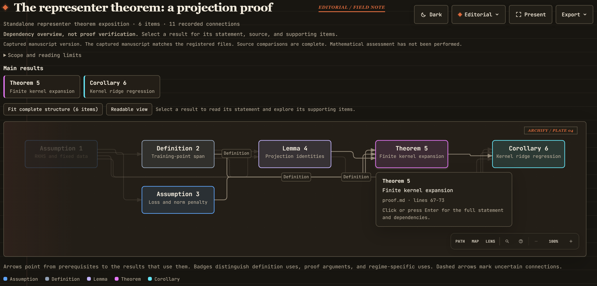

# Proof Graphify

[](https://github.com/rqzhu-aide/proof-graphify/tree/v3.1.2)

**Explore a paper's main results, important prerequisites, and connections in the style of [Archify](https://github.com/tt-a1i/archify).**

The skill selects the results that explain the paper's central contributions, records concise faithful summaries and sourced connections in a local SQLite database, and generates an interactive HTML graph. Follow prerequisites, inspect source passages, and navigate the argument without reconstructing individual proof steps. The selected scope is visible; unselected declarations do not require exhaustive bookkeeping.

The records remain reusable: [revise the overview](references/revisions.md) as the manuscript changes, or [hand the records to proofcheck](references/audit-database.md) as a starting inventory for a deeper audit. Source comparison checks the overview against the paper; it does not certify proof validity. Existing detailed databases retain their content and history.

[](examples/overview-browser.png)

Open the [example HTML](examples/representer-theorem/overview.html) locally to explore statements and trace dependencies. Read its [source proof](examples/representer-theorem/proof.md).

## Use

Install this repository as `proof-graphify` in your agent's skill directory, then ask:

```text
Use proof-graphify to map this paper's main results and the important prerequisites that explain them, including relevant appendix results.
```

Requires shared Python 3.10+, Node.js, and `latex2mathml`; PDF input also uses `pypdf`. No separate Archify installation is needed. See [SKILL.md](SKILL.md) for the workflow.

## Output

```text
proof-graphify-<paper-name>/
  overview.html
  data/paper-records.sqlite
```

**Share the HTML alone. Keep the database for future revisions.** See the [database guide](references/database.md) for focused initialization, editing, and export, and [SKILL.md](SKILL.md) for the current skill version.

[MIT license](LICENSE) · [Third-party notices](THIRD_PARTY_NOTICES.md)
